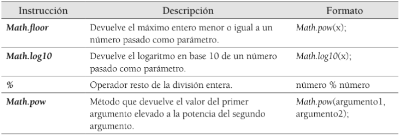

# Amstrong

Enunciado:
Se quiere desarrollar un programa que determine si un número es un número de Amstrong. Un número de Amstrong es aquel que es igual a la suma de sus dígitos elevados a la potencia de su número de cifras.

Por ejemplo, el número 371 es un número que cumple dicha característica ya que tiene tres cifras y:
371 = 33 + 73 + 13 = 27 + 343 + 1 = 371

## Diagrama de clases

